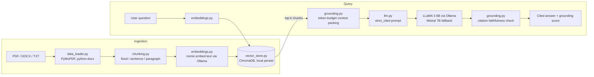

# WhatUpDoc Architecture

Every arrow below stays on the local machine. The only network sockets
opened by the application connect to the local Ollama server
(`localhost:11434`), enforced by `assert_local_host()` in
`utils/helpers.py`.

## Module responsibilities

| Module | Responsibility | Primary owner |
|---|---|---|
| `src/data_loader.py` | Text extraction + citation metadata | Sean |
| `src/chunking.py` | Three chunking strategies (RQ1) | Sean |
| `src/embeddings.py` | Local embedding client + privacy guard | Chris |
| `src/grounding.py` | Citation faithfulness check + context packing | Chris |
| `src/vector_store.py` | ChromaDB persistence and retrieval | Claudia |
| `src/llm.py` | LLM client, prompt engineering, grounded generation, fallback | Chris |
| `src/rag_pipeline.py` | End-to-end orchestration | shared |
| `src/model_runner.py` | Single-command demo | shared |
| `app.py` | Gradio UI (localhost only) | shared |
| `experiments/` | Preliminary + RQ experiments | Claudia / Kat |
| `data/make_samples.py` | Synthetic test corpus (no real PII) | Claudia |

## Design decisions

1. **Caller-supplied embeddings only.** ChromaDB's default embedding
   function downloads a model from the internet; we never invoke it.
2. **Standard-library HTTP.** Ollama calls use `urllib` — no requests/
   httpx dependency, and the entire network surface fits in two short
   modules that can be audited in minutes.
3. **Config over code.** Model names, chunking parameters, top-k, and
   prompt profile all live in `configs/config.yaml` so experiments can
   vary one factor at a time without code changes.
4. **Fail loud, fail early.** A non-localhost endpoint raises before
   any request; a missing Ollama server produces a setup instruction,
   not a stack trace.
